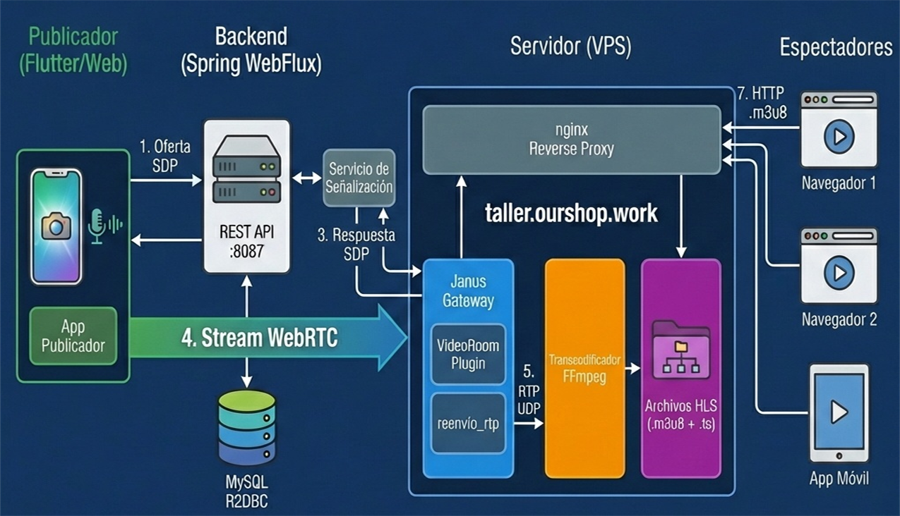

<!-- _class: lead invert -->
<!-- _header: '' -->
<!-- _footer: '' -->

# 🎥 Construyendo una Plataforma de Streaming
## Jornada 1: Backend Reactivo (Spring WebFlux)

👨‍🏫 Instructor: Gerson Castellanos y Joel Acosta

⏱️ Duración: 4 Horas

---

<!-- _class: invert -->

## 🗺️ Roadmap del Taller

<div style="display: grid; grid-template-columns: 1fr 1fr 1fr; gap: 20px; text-align: center;">

<div style="border: 2px solid #c3e88d; padding: 20px; border-radius: 10px; background: #2a2a2a;">

### 👉 JORNADA 1
**(HOY)**
Backend Reactivo

</div>

<div style="opacity: 0.5; padding: 20px; border: 1px solid #546e7a; border-radius: 10px;">

### JORNADA 2
WebRTC + Janus

</div>

<div style="opacity: 0.5; padding: 20px; border: 1px solid #546e7a; border-radius: 10px;">

### JORNADA 3
Flutter Mobile

</div>

</div>

---

## ✈️ Checklist de Vuelo (Prerrequisitos)

Antes de despegar, verifiquemos el equipaje:

<table style="border:none; width:100%; font-size: 0.9em; table-layout: fixed;">
<tr style="background: none;">
<td style="border:none; width:50%; vertical-align:top; border-right: 2px solid #546e7a; padding-right: 20px;">

### 💻 Hardware & OS
*   **RAM:** 8GB+ (16GB Rec).
*   **Disk:** 10GB Libre.
*   **OS:** Windows/Mac/Linux.

### ☕ Java
*   **JDK 21** (Virtual Threads).
*   `java -version`

</td>
<td style="border:none; width:50%; vertical-align:top; padding-left: 20px;">

### 🛠️ Herramientas
*   **IDE:** IntelliJ o VS Code.
*   **Git:** Clonar y Pushear.
*   **cURL:** Para testing API.

### 🔑 Accesos
*   Cuenta GitHub/GitLab activa.
*   Permisos de escritura SSH/Token.

</td>
</tr>
</table>

---

## 🎯 Objetivos de Hoy

1.  **Entender la Arquitectura:** WebRTC + Janus + HLS.
2.  **Spring WebFlux:** Programación Reactiva vs Imperativa.
3.  **R2DBC:** Bases de datos SQL no bloqueantes.
4.  **Live Coding:** Crear el API de gestión de Streams (`StreamMeta`).

---

<!-- _class: invert -->

## 🏗️ La Arquitectura "Big Picture"


<!-- Diagrama Arquitectura Simplificado -->
<div style="display: flex; justify-content: center; width: 100%; margin-top: 20px;">



</div>


---

## ☢️ Fundamentos de Reactor
### Blocking vs Non-Blocking

<table style="border:none; width:100%; font-size: 0.8em; table-layout: fixed;">
<tr style="background: none;">
<td style="border:none; width:50%; vertical-align:top; background: #2a2a2a; border-radius: 12px; padding: 15px; border: 1px solid #ff5370;">

### 🚫 Pizzería Bloqueante
**(Spring MVC)**

*   1 Cocinero por pedido.
*   Se queda **mirando** el horno.
*   **Colapsa** con muchos clientes.

</td>
<td style="border:none; width:50%; vertical-align:top; background: #2a2a2a; border-radius: 12px; padding: 15px; border: 1px solid #c3e88d;">

### ✅ Pizzería Reactiva
**(WebFlux)**

*   1 Cocinero (Event Loop).
*   **Mete** al horno y sigue.
*   "Avísame cuando suene".
*   **Escala** infinito.

</td>
</tr>
</table>

---

## 📦 Mono vs Flux

| Tipo | Analogía | Uso |
|:---:|:---:|:---|
| **Mono<T>** | 📦 Caja de Amazon | `findById`, `save` (0 o 1 elemento) |
| **Flux<T>** | 🍣 Cinta de Sushi | `findAll`, Streams infinitos (0 a N elementos) |

> ⚠️ **Regla de Oro:** Nada pasa hasta que te **suscribes** (`.subscribe()`).

---

## 🛠️ Manos a la Obra: Setup

<div style="display: grid; grid-template-columns: 1fr 1fr; gap: 20px; align-items: center;">

<div>

1.  **Generar Proyecto:**
    Spring Initializr.
    *   *Deps:* WebFlux, R2DBC, Lombok, MySQL.
2.  **Docker/MySQL:**
    Levantamos la DB local.
3.  **Config:**
    `application.yml` + `.env`.

</div>

<div>

```yaml
spring:
  r2dbc:
    url: r2dbc:mysql://localhost:3306/streamingdb
```

</div>

</div>

</div>

---

<!-- _class: invert lead -->
<!-- _header: '' -->
<!-- _footer: '' -->

# ☕ Break 1 (10 min)
## Tómate un café ☕

---

## 🧬 Modelo: StreamMeta

Definimos el estado del stream con una **State Machine** estricta:

*   `CREATED` ➡️ Agendado.
*   `LIVE` ➡️ Transmitiendo.
*   `ENDED` ➡️ Finalizado.

> **Importante:** No se puede pasar de `CREATED` a `ENDED` sin pasar por `LIVE`.

---

<!-- _class: invert lead -->
<!-- _header: '' -->
<!-- _footer: '' -->

# ☕ Break 2 (10 min)
## ¡Estiramiento! 🧘‍♂️

---

## 💻 Live Coding: Service & Controller

<table style="border:none; width:100%; font-size: 0.85em;">
<tr style="background: none;">
<td style="border:none; width:55%; vertical-align:top; padding-right: 20px;">

### 🏗️ Implementaremos
1.  **Repository:**
    `R2dbcRepository` (No Blocking).
2.  **Service:**
    Lógica de negocio + Validaciones.
3.  **Controller:**
    Endpoints REST (@RestController).

</td>
<td style="border:none; width:45%; vertical-align:top;">

### 🔑 Operadores Clave
*   **`.map()`**
    Transformar dato síncrono (1-1).
*   **`.flatMap()`**
    Encadenar llamada asíncrona (DB).
*   **`.switchIfEmpty()`**
    Manejar 404 si está vacío.

</td>
</tr>
</table>

---

## ❓ Preguntas Frecuentes (J1)

### ¿Dudas sobre Reactor?
### ¿Por qué WebFlux?

> *Este es el momento de disparar...* 🔫


---

## 🔥 Pruebas de Fuego (cURL)

<div style="font-size: 0.85em;">

**1. Crear Stream:**
`POST /api/v1/streams`
```json
{"title": "Live Coding Session", "description": "WebFlux demo"}
```

**2. Listar Streams:**
`GET /api/v1/streams?page=0&size=5`

**3. Transiciones de Estado:**
`PUT /api/v1/streams/{id}/start` ➡️ **LIVE**
`PUT /api/v1/streams/{id}/end` ➡️ **ENDED**

</div>

---

## 🛡️ Manejo de Errores

No queremos Stacktraces feos. Implementaremos:

1.  **404 Not Found:**
    Cuando el ID no existe en DB.
    *   *Uso:* `switchIfEmpty(Mono.error(...))`

2.  **409 Conflict:**
    Transición de estado inválida (Ej: `CREATED` -> `ENDED`).

3.  **400 Bad Request:**
    Validación de datos (Ej: Título vacío).

---

<!-- _class: lead invert -->

# 🏁 Cierre Jornada 1

---

## ✅ Resumen de Logros

| Concepto | Estado |
|---|---|
| 🏗️ **Backend Setup** | Spring Boot 3 + WebFlux Configurado |
| 🗄️ **Persistencia** | R2DBC + MySQL (Non-blocking) |
| 🔄 **Reactividad** | Flujos `Mono` y `Flux` dominados |
| 🧠 **Lógica** | State Machine (Created -> Live -> End) |
| 🌐 **API** | CRUD REST Completo |

---

## 💾 Git Checkpoint

Instructor commitea, alumnos hacen pull:

```bash
git add .
git commit -m "Jornada 1 completa: CRUD StreamMeta"
git tag checkpoint/j1-crud-streammeta
git push origin main --tags
```

**Alumnos:**
```bash
git pull
```

---

# ¡Nos vemos mañana! 👋
## Próximo: WebRTC, Janus y Video Real 📹
