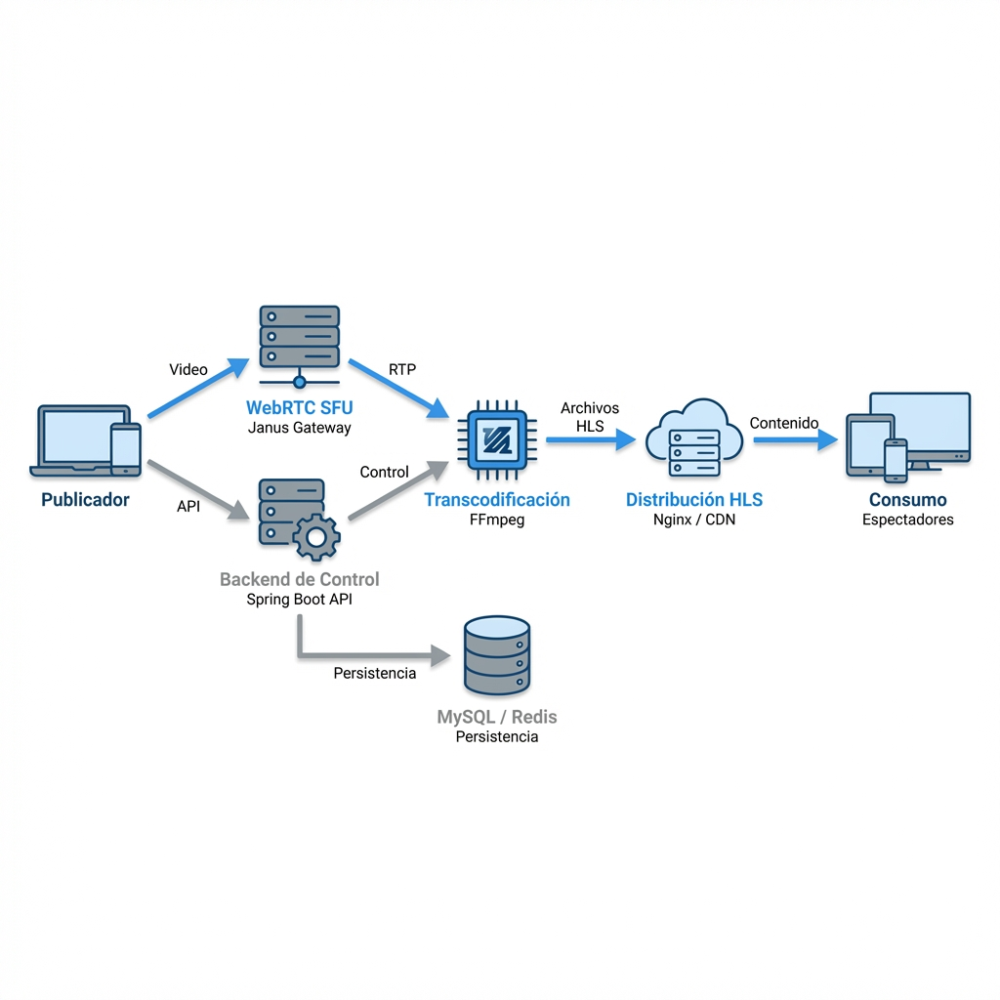
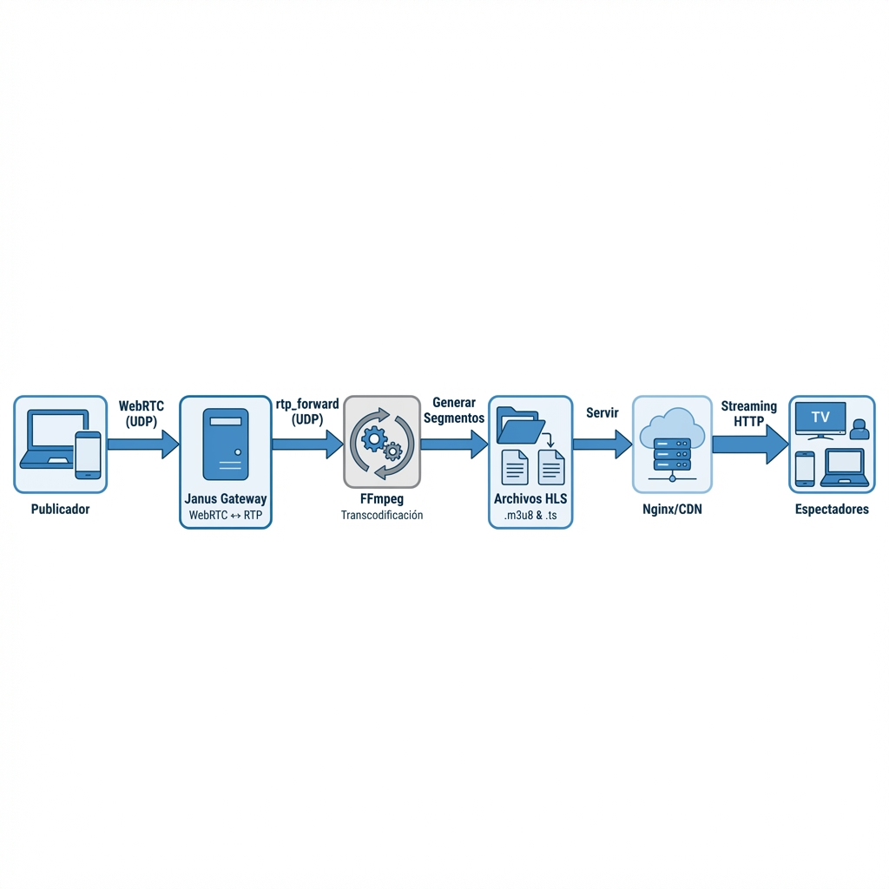
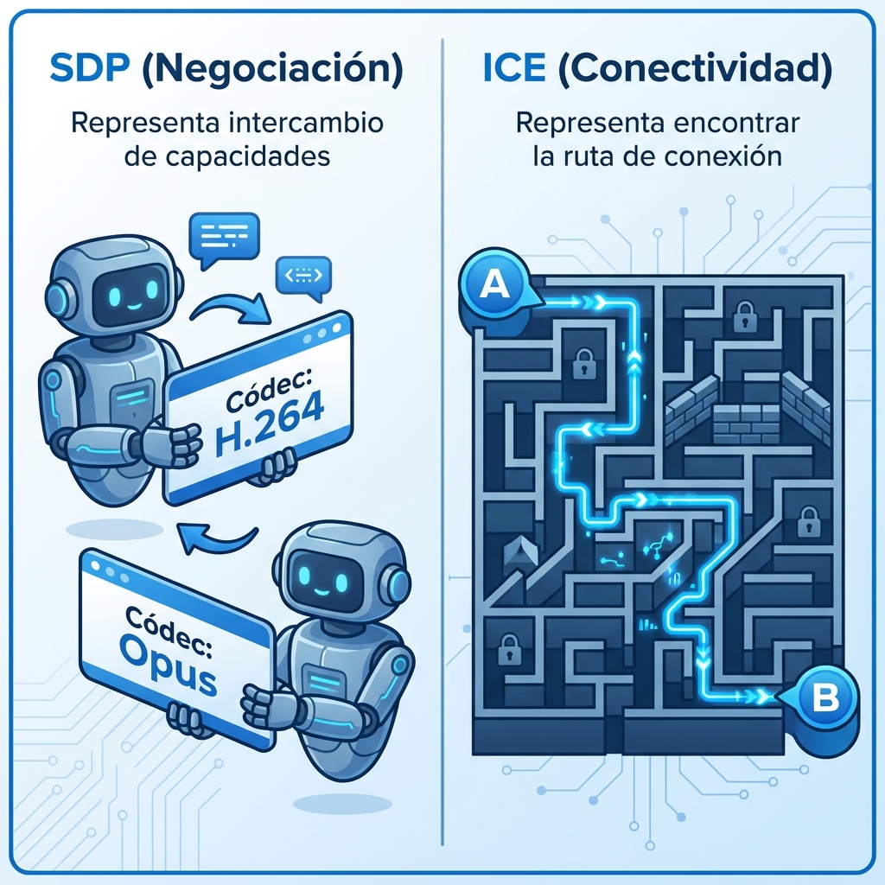

# 🎓 Guión del Taller: Streaming WebRTC + Spring WebFlux

> **Documento para el Instructor** — Guión completo para dictar el taller de 3 jornadas

---

## 📅 Estructura del Taller

| Jornada | Duración | Enfoque | Repositorio |
|:-------:|:--------:|---------|-------------|
| **1** | 4 horas | Backend: Setup + CRUD Reactivo | ✅ Este repo |
| **2** | 4 horas | Backend: WebRTC + Janus + HLS | ✅ Este repo |
| **3** | 4 horas | Frontend: Flutter Publisher | 📱 Repo Flutter (separado) |

> ⚠️ **Nota**: Este guión cubre las **Jornadas 1 y 2** (backend). La Jornada 3 (Flutter) tiene su propio repositorio y documentación.

---

## 🛠️ Prerrequisitos (Hardware & Software)

> **Antes de empezar:** Asegúrate de que todos los alumnos cumplan con los requisitos descritos en [PRERREQUISITOS_TALLER.md](./PRERREQUISITOS_TALLER.md). Incluye instrucciones para generar el proyecto desde cero con **Spring Initializr**.

---

## 📋 Análisis y Recomendaciones

### ✅ Fortalezas del Nuevo Formato

1. **Más tiempo para backend**: 8 horas permite profundizar sin prisas
2. **Separación clara**: Backend y Frontend en sesiones distintas
3. **Flexibilidad**: Los alumnos pueden asistir solo a backend si prefieren

### 💡 Recomendaciones

- Preparar **snippets copiables** para cada bloque (evita errores de tipeo)
- Tener **2 terminales visibles**: una para backend, otra para logs/curl
- Usar **VS Code Live Share** o similar para troubleshooting remoto rápido
- **Tips Pro**: Mencionar casos de borde reales (ej: qué pasa si FFmpeg se cuelga)

---

## 📚 Referencias del Proyecto (Backend)

| Componente | Ruta del Archivo |
|------------|------------------|
| Entidad principal | [StreamMeta.java](../src/main/java/com/ourshop/streaming/streams/model/StreamMeta.java) |
| Estado del stream | [StreamStatus.java](../src/main/java/com/ourshop/streaming/streams/model/StreamStatus.java) |
| Controlador CRUD | [StreamMetaController.java](../src/main/java/com/ourshop/streaming/streams/controller/StreamMetaController.java) |
| Servicio de streams | [StreamMetaCrudService.java](../src/main/java/com/ourshop/streaming/streams/service/StreamMetaCrudService.java) |
| Cliente Janus | [JanusClient.java](../src/main/java/com/ourshop/streaming/webrtc/janus/JanusClient.java) |
| Servicio FFmpeg/HLS | [FfmpegHlsService.java](../src/main/java/com/ourshop/streaming/webrtc/hls/FfmpegHlsService.java) |
| Signaling WebRTC | [WebRtcSignalingController.java](../src/main/java/com/ourshop/streaming/webrtc/controller/WebRtcSignalingController.java) |
| Configuración ejemplo | [.env.example](../.env.example) |
| POM del proyecto | [pom.xml](../pom.xml) |

---

# 📅 JORNADA 1 — CRUD Reactivo con Spring WebFlux (4 horas)

## 🎯 Objetivo de la Jornada
> Al terminar, los alumnos tendrán un backend WebFlux funcionando con CRUD completo de `StreamMeta`, state machine, y comprenderán los fundamentos de programación reactiva.

---

## Bloque J1-0: Bienvenida y Setup Inicial
**⏱️ Tiempo: 00:00 – 00:30 (30 min)**

### 🗣️ Guión para Dictar

> *"¡Bienvenidos al taller de Streaming con WebRTC y Spring WebFlux!*
>
> *En estas tres jornadas vamos a construir una plataforma de live streaming completa:*
> - *Hoy y mañana: Backend reactivo con Java 21 + integración WebRTC*
> - *La tercera jornada: App Flutter para publicar video*
>
> *No es un taller teórico: van a tocar código, van a romper cosas, van a debuggear, y al final van a tener algo funcionando.*
>
> *La dinámica es simple: yo commiteo código, ustedes hacen pull. Si se pierden, hacen checkout al último tag y seguimos. Nadie se queda atrás."*

### 📋 Acciones del Instructor

1. **Mostrar diagrama de arquitectura** (5 min):



**📄 Guión del Gráfico:** Ver [EXPLICACION_ARQUITECTURA.md](./EXPLICACION_ARQUITECTURA.md) para la narrativa paso a paso explicada.

**Explicación visual del flujo:**

| Paso | Componente | Descripción |
|:----:|------------|-------------|
| 1️⃣ | Publisher → API | Cliente envía SDP Offer con capacidades de video/audio |
| 2️⃣ | API → Janus | Backend reenvía Offer a Janus VideoRoom |
| 3️⃣ | Janus → API | Janus responde con SDP Answer (`a=recvonly`) |
| 4️⃣ | Publisher → Janus | WebRTC Media - Video/audio fluye por conexión WebRTC |
| 5️⃣ | rtp_forward | Janus reenvía RTP a puerto UDP local (FFmpeg) |
| 6️⃣ | FFmpeg → HLS | Transcodifica a H264 y genera segmentos .ts |
| 7️⃣ | Viewers → nginx | Viewers solicitan archivos .m3u8 via HTTP |

2. **Mostrar el servidor central** (sin tocar infra):
   - Abrir `https://taller.ourshop.work/actuator/health`
   - Mostrar que existe y responde

3. **Verificar que todos clonaron el repo**:
   ```bash
   git clone <URL_DEL_REPO>
   cd streaming
   ```

### ✅ Checkpoint
- [ ] Todos tienen el repo clonado
- [ ] Todos ven la estructura del proyecto en su IDE

---

## Bloque J1-1: Setup Backend Local + MySQL
**⏱️ Tiempo: 00:30 – 01:15 (45 min)**

### 🗣️ Guión para Dictar

> *"Ahora vamos a levantar el backend en local. Cada uno va a tener su propia base de datos MySQL. El backend usa R2DBC, que es el driver reactivo para bases de datos relacionales.*
>
> *¿Por qué reactivo? Porque en streaming vamos a manejar miles de conexiones simultáneas. Con el modelo tradicional de Spring MVC, cada request bloquea un thread. Con WebFlux, un solo thread puede manejar muchas requests porque no se bloquea esperando I/O."*

### 📋 Pasos Guiados

**1. Crear base de datos en MySQL (solo la base, sin tablas):**
```sql
CREATE DATABASE streamingdb CHARACTER SET utf8mb4 COLLATE utf8mb4_unicode_ci;
-- ¡Eso es todo! Las tablas se crean automáticamente al arrancar la app
```

> 💡 *"A diferencia de JPA/Hibernate que tiene `ddl-auto`, R2DBC no genera DDL automáticamente. Por eso tenemos un `StreamMetaSchemaInitializer` que ejecuta `CREATE TABLE IF NOT EXISTS` al arrancar. Es idempotente: si las tablas ya existen, no hace nada."*

**2. Configurar archivo `.env`:**
```bash
# En la carpeta raíz del proyecto
copy .env.example .env
# Editar .env con los valores locales
```

Contenido del `.env`:
```properties
# Base de datos local
SPRING_R2DBC_URL=r2dbc:mysql://localhost:3306/streamingdb
DB_USERNAME=root
DB_PASSWORD=tu_password_aqui

# Servidor central (para Jornada 2)
JANUS_URL=https://taller.ourshop.work/janus
JANUS_ROOM_ID=1234
WEBRTC_HLS_PUBLIC_BASE_URL=https://taller.ourshop.work/webrtc-hls
```

**3. Ejecutar el backend:**
```bash
# Windows
mvnw.cmd -DskipTests spring-boot:run

# macOS/Linux
./mvnw -DskipTests spring-boot:run
```

**4. Verificar que levanta:**
```bash
curl http://localhost:8087/actuator/health
# Debe responder: {"status":"UP"}
```

**5. Verificar tablas (opcional):**
```sql
USE streamingdb;
SHOW TABLES;
-- Deberían ver: stream_meta
```

### 🗣️ Explicación Complementaria

> *"Fíjense que usamos `DotenvInitializer` para cargar las variables de entorno. Esto nos permite tener configuraciones diferentes entre desarrollo y producción sin tocar el código.*
>
> *El puerto 8087 está configurado en `application.yml`. En producción usamos nginx como reverse proxy."*

**Archivo de referencia:** [DotenvInitializer.java](../src/main/java/com/ourshop/streaming/infra/DotenvInitializer.java)

### ✅ Checkpoint
- [ ] `GET http://localhost:8087/actuator/health` → `200 OK`
- [ ] Tabla stream_meta existe en MySQL

---

## ☕ BREAK (10 min)
**⏱️ Tiempo: 01:15 – 01:25**

---

## Bloque J1-2: Modelo StreamMeta + State Machine (Profundización)
**⏱️ Tiempo: 01:25 – 02:45 (80 min)**

### 🗣️ Guión para Dictar

> *"Ahora viene lo interesante: vamos a entender el modelo de datos para nuestros streams.*
>
> *Un stream tiene un ciclo de vida muy claro definido por nuestra State Machine:*
> 1. *`CREATED`: El stream está agendado pero inactivo.*
> 2. *`LIVE`: El publisher está emitiendo video activamente.*
> 3. *`ENDED`: El stream finalizó y es histórico.*
>
> *Las transiciones son estrictas: No puedes ir de `CREATED` a `ENDED` sin pasar por `LIVE`. No puedes "revivir" un stream `ENDED`. Esto evita inconsistencias graves en producción."*

### 📋 Archivos a Revisar

**1. Enum de estados:**

```java
// StreamStatus.java
public enum StreamStatus {
    CREATED,
    LIVE,
    ENDED
}
```
**Referencia:** [StreamStatus.java](../src/main/java/com/ourshop/streaming/streams/model/StreamStatus.java)

**2. Record del modelo:**
Discutir por qué usar `record` (inmutabilidad, DTO-like behavior nativo).

```java
// StreamMeta.java - Java 17+ Record
public record StreamMeta(
    UUID id,
    String streamKey,
    String title,
    String description,
    StreamStatus status,
    Instant createdAt,
    Instant startedAt,
    Instant endedAt
) {}
```
**Referencia:** [StreamMeta.java](../src/main/java/com/ourshop/streaming/streams/model/StreamMeta.java)

**3. Schema Initializer (Análisis técnico):**
Profundizar en `DatabaseClient` de Spring R2DBC y cómo se encadenan operaciones SQL con `.then()`.

**Referencia:** [StreamMetaSchemaInitializer.java](../src/main/java/com/ourshop/streaming/streams/infra/StreamMetaSchemaInitializer.java)

> **💡 Nota para el Instructor:**
> Haz énfasis en que la *State Machine* no es solo un enum, son **reglas de negocio**.
> Preguntar a la clase: *"¿Qué pasaría si permitimos pasar de CREATED a ENDED sin transmitir?"*
> Respuesta esperada: *"Tendríamos registros de streams vacíos que nunca existieron realmente."*
> Esto ayuda a justificar por qué escribimos validaciones extra en el servicio.

### � Fundamentos de Reactor (30 min)

> *"Vamos a dedicar tiempo a entender Reactor, porque es donde la mayoría se confunde:*
>
> - *`Mono<T>` vs `Flux<T>`: Cardinalidad 0-1 vs 0-N.*
> - *El concepto de **Backpressure**: ¿Qué pasa si el cliente lee más lento de lo que la DB entrega? Reactor lo maneja automático.*
> - *`subscribeOn` vs `publishOn`: Controlando en qué thread se ejecutan las cosas.*
>
> *Operadores clave en detalle:*
> - *`map()`: síncrono, 1 a 1.*
> - *`flatMap()`: asíncrono, 1 a N (o 1 a 1 asíncrono). El operador más importante.*
> *`switchIfEmpty()`: el `else` de los streams reactivos.*
> *`zip()`/`zipWith()`: combinar resultados de dos monos en paralelo (ej: traer usuario y stream al mismo tiempo).*"

**📄 Guión Detallado (30 min):** Ver [FUNDAMENTOS_REACTOR.md](./FUNDAMENTOS_REACTOR.md) para explicación paso a paso, analogías (Pizzeros) y Marble Diagrams.

### ✅ Checkpoint
- [ ] Todos entienden el ciclo CREATED → LIVE → ENDED
- [ ] Entienden la diferencia entre Mono y Flux
- [ ] Comprenden por qué usar `flatMap` para llamadas a DB

---

## ☕ BREAK (10 min)
**⏱️ Tiempo: 02:45 – 02:55**

---

## Bloque J1-3: Service + Controller + CRUD Completo
**⏱️ Tiempo: 02:55 – 03:45 (50 min)**

### 🗣️ Guión para Dictar

> *"Ahora vamos a exponer el CRUD como API REST y a probarlo con curl."*

### 📋 Estructura de Archivos

```
streams/
├── controller/
│   └── StreamMetaController.java
├── dto/
│   ├── CreateStreamMetaRequest.java
│   ├── StreamMetaResponse.java
│   └── StreamMetaPageResponse.java
├── service/
│   └── StreamMetaCrudService.java
└── repo/
    └── R2dbcStreamMetaRepository.java
```

**Referencias:**
- [StreamMetaController.java](../src/main/java/com/ourshop/streaming/streams/controller/StreamMetaController.java)
- [StreamMetaCrudService.java](../src/main/java/com/ourshop/streaming/streams/service/StreamMetaCrudService.java)

### 📋 Pruebas con curl (práctica guiada)

**Crear stream:**
```bash
curl -X POST http://localhost:8087/api/v1/streams \
  -H "Content-Type: application/json" \
  -d '{"title": "Mi primer live", "description": "Probando el sistema"}'
```

**Listar streams:**
```bash
curl "http://localhost:8087/api/v1/streams?page=0&size=5"
```

**Obtener por ID:**
```bash
curl http://localhost:8087/api/v1/streams/{id}
```

**Iniciar stream (pasar a LIVE):**
```bash
curl -X PUT http://localhost:8087/api/v1/streams/{id}/start
```

**Finalizar stream:**
```bash
curl -X PUT http://localhost:8087/api/v1/streams/{id}/end
```

### 🗣️ Demostración de State Machine

> *"Vean cómo la transición de estados funciona. Si intento hacer `end` sin haber hecho `start` primero..."*

```bash
# Esto debe fallar con 409 Conflict
curl -X PUT http://localhost:8087/api/v1/streams/{id}/end
```

### ✅ Checkpoint
- [ ] POST crear funciona
- [ ] GET listar con paginación funciona
- [ ] PUT start funciona
- [ ] PUT end funciona
- [ ] Transición inválida retorna 409

---

## Bloque J1-4: Manejo de Errores + Cierre
**⏱️ Tiempo: 03:45 – 04:00 (15 min)**

### 🗣️ Guión para Dictar

> *"Un buen API no solo funciona cuando todo va bien. Tiene que fallar elegantemente:*
> - *404 cuando el stream no existe*
> - *409 cuando la transición de estado es inválida*
> - *400 cuando los datos de entrada son incorrectos*
> 
> *Spring WebFlux usa `GlobalErrorWebExceptionHandler` o `@ControllerAdvice`. Nosotros usaremos una estructura limpia de excepciones custom."*

**Referencia:** [errors/](../src/main/java/com/ourshop/streaming/streams/errors/)

### ✅ Checkpoint
- [ ] GET de ID inexistente → 404
- [ ] Transición inválida → 409
- [ ] POST sin título → 400

### 🗣️ Guión de Cierre Jornada 1

> *"¡Excelente trabajo hoy! Recapitulemos lo que lograron:*
>
> ✅ *Backend reactivo corriendo con WebFlux*
> ✅ *Persistencia reactiva con R2DBC*  
> ✅ *CRUD completo con paginación*
> ✅ *State machine para ciclo de vida del stream*
> ✅ *Manejo de errores apropiado*
>
> *Mañana viene lo más emocionante: WebRTC, Janus, y ver video real transmitiendo."*

### 📋 Acciones del Instructor
```bash
git add .
git commit -m "Jornada 1 completa: CRUD StreamMeta"
git tag checkpoint/j1-crud-streammeta
git push origin main --tags
```

**Alumnos:**
```bash
git pull
```

---

## ❓ Bloque de Preguntas y Respuestas J1 (Preparación para el Instructor)

> **Anticipate a las preguntas difíciles:**

**Q: ¿Por qué usamos R2DBC y no JDBC con Virtual Threads (Java 21)?**
**A:** "Virtual Threads ayudan a escalar I/O bloqueante, pero R2DBC ofrece un modelo *push* real desde la base de datos (Backpressure). JDBC sigue siendo *pull*. Con WebFlux, toda la cadena es reactiva. Aunque Virtual Threads cierran la brecha, el ecosistema reactivo te da operadores funcionales (`retry`, `timeout`, `zip`) que en imperativo son difíciles de escribir."

**Q: ¿Qué pasa si hago `.block()` en un Controller?**
**A:** "Congelas el Event Loop de Netty. Si tienes 1 hilo, detienes TODO el servidor para TODOS los usuarios. Es un suicidio de rendimiento. Para bloquear, tendrías que envolverlo en `Mono.fromCallable().subscribeOn(Schedulers.boundedElastic())`."

**Q: ¿Cómo debugeamos si el Stacktrace es inútil?**
**A:** "Reactor tiene herramientas como `Hooks.onOperatorDebug()` (pesado en prod) o el Reactor Debug Agent (mejor). También es vital poner buenos logs dentro de `.doOnNext()` o `.doOnError()` para saber por dónde pasan los datos."

**Q: ¿Por qué tanto `flatMap`? ¿Por qué no usar simple `map`?**
**A:** "Esta es la duda #1.
- `map` transforma datos síncronamente (Objeto A -> Objeto B).
- `flatMap` transforma asíncronamente (Objeto A -> `Mono<Objeto B>`).
- Si usas `map` cuando llamas a la base de datos, terminas con `Mono<Mono<User>>` (una caja dentro de una caja). `flatMap` 'aplana' esa estructura para devolverte solo `Mono<User>`.
- **Regla de oro:** Si tu transformación devuelve un tipo reactivo (Mono/Flux), usa `flatMap`."

**Q: ¿Por qué no usamos JPA (Hibernate)?**
**A:** "JPA es bloqueante por diseño (especificación JDBC antigua). Aunque uses Virtual Threads, JPA mantiene conexiones abiertas esperando I/O, lo que limita la escalabilidad masiva en streaming. R2DBC es totalmente *non-blocking* y permite manejar miles de conexiones con pocos hilos."

**Q: ¿Por qué Java? ¿No es mejor Python o Go para esto?**
**A:** "Gran pregunta de arquitectura.
- **Vs Python:** Python (FastAPI/Django) es genial para IA, pero sufre con concurrencia masiva real por el GIL (Global Interpreter Lock). Java WebFlux es superior en throughput puro.
- **Vs Go:** Go es el rey del cloud (casi todo Kubernetes/Docker es Go) y es una alternativa fantástica (ver el archivo `COMPARATIVA_JAVA_PYTHON.md` en el repo).
- **Veredicto:** Usamos Java + WebFlux porque en entornos corporativos ya existe el talento Java, y con WebFlux otenemos el rendimiento de Go sin cambiar de lenguaje."

---

# 📅 JORNADA 2 — WebRTC + Janus + Pipeline HLS (4 horas)

## 🎯 Objetivo de la Jornada
> Integrar signaling WebRTC con Janus Gateway y generar HLS reproducible en cualquier navegador.

---

## Bloque J2-0: Recap + Demo del Servidor Central
**⏱️ Tiempo: 00:00 – 00:30 (30 min)**

### 🗣️ Guión para Dictar

> *"Bienvenidos a la segunda jornada. Antes de meter manos al código, necesitan entender qué está pasando en el servidor central.*
>
> *WebRTC NO genera HLS directamente. El flujo es:*
>
> 
>
> 1. *El publisher (Flutter/navegador) envía video por WebRTC*
> 2. *Janus Gateway recibe ese video*
> 3. *Janus hace `rtp_forward` — reenvía el video como RTP a un puerto UDP*
> 4. *FFmpeg escucha en ese puerto UDP*
> 5. *FFmpeg convierte RTP a HLS (archivos .m3u8 y .ts)*
> 6. *nginx sirve esos archivos a los viewers*

### 📋 Mostrar en el Servidor

1. **Configuración nginx** (explicar rutas):
   - `/janus` → API de Janus
   - `/api/` → Backend Spring Boot
   - `/webrtc-hls/` → Archivos HLS

2. **Logs** (mostrar dónde mirar):
   - Logs del backend
   - Logs de Janus (Explicar nivel de detalle: 1-7)
   - `ffmpeg.log` (Explicar stats de bitrate/fps)

### 🗣️ Concepto Clave: SDP y ICE (Explicación Avanzada)

> *"WebRTC usa dos conceptos fundamentales que deben dominar:*
>
> - *SDP (Session Description Protocol): Es como la tarjeta de presentación de capacidades. 'Hablo H264 profile high', 'Tengo audio Opus', 'Quiero recibir video, no enviar'.*
>
> - *ICE (Interactive Connectivity Establishment): Es el proceso de encontrar cómo conectar A con B a través de NATs y Firewalls. STUN te dice tu IP pública. TURN es un relay si P2P falla.*
>
> *El 'Trickle ICE' significa que no esperamos a tener TODOS los caminos posibles. A medida que encontramos uno, lo enviamos. Esto hace que la conexión se sienta instantánea."*
>
> 

### ✅ Checkpoint Mental
- [ ] Todos entienden el flujo Publisher → Janus → FFmpeg → HLS

---

## Bloque J2-1: Configuración Local para VPS Central
**⏱️ Tiempo: 00:30 – 00:45 (15 min)**

### 🗣️ Guión para Dictar

> *"Ahora vamos a verificar que nuestro backend local puede comunicarse con el servidor central. Ya tienen las variables en el `.env` de ayer."*

### 📋 Verificar `.env`

```properties
# Estas son las que importan hoy
JANUS_URL=https://taller.ourshop.work/janus
JANUS_ROOM_ID=1234
WEBRTC_HLS_PUBLIC_BASE_URL=https://taller.ourshop.work/webrtc-hls
```

### ✅ Checkpoint
- [ ] Backend levanta sin errores
- [ ] `curl http://localhost:8087/actuator/health` → UP

---

## Bloque J2-2: Endpoints WebRTC (ICE + Signaling)
**⏱️ Tiempo: 00:45 – 01:25 (40 min)**

### 🗣️ Guión para Dictar

> *"Vamos a revisar la API que Flutter (o cualquier cliente WebRTC) va a usar:*
>
> - *`GET /ice-servers`: devuelve servidores STUN/TURN*
> - *`POST /webrtc/offer`: recibe el SDP Offer, devuelve Answer + hlsUrl*
> - *`POST /webrtc/ice`: recibe ICE candidates*
> - *`DELETE /webrtc`: cierra la sesión WebRTC"*

### 📋 Estructura de Archivos

```
webrtc/
├── controller/
│   ├── WebRtcIceServersController.java
│   └── WebRtcSignalingController.java
├── dto/
│   ├── SdpOfferRequest.java
│   ├── IceCandidateRequest.java
│   └── SdpAnswerResponse.java
└── service/
    └── WebRtcSignalingService.java
```

**Referencias:**
- [WebRtcSignalingController.java](../src/main/java/com/ourshop/streaming/webrtc/controller/WebRtcSignalingController.java)
- [WebRtcIceServersController.java](../src/main/java/com/ourshop/streaming/webrtc/controller/WebRtcIceServersController.java)

### 📋 Prueba Rápida

```bash
curl http://localhost:8087/api/v1/webrtc/ice-servers
```

### ✅ Checkpoint
- [ ] GET ice-servers responde con array de servidores

---

## ☕ BREAK (10 min)
**⏱️ Tiempo: 01:25 – 01:35**

---

## Bloque J2-3: Cliente Janus (Deep Dive)
**⏱️ Tiempo: 01:35 – 02:50 (75 min)**

### 🗣️ Guión para Dictar

> *"Este es el corazón de la integración. El `JanusClient` habla con Janus Gateway vía HTTP. Vamos a diseccionar el protocolo de Janus VideoRoom."*
>
> *El flujo es secuencial y delicado:*
> 1. *`create` session: Obtenemos un `session_id`.*
> 2. *`attach` plugin: Nos conectamos a `janus.plugin.videoroom`. Obtenemos `handle_id`.*
> 3. *`joinandconfigure` (Publish): Enviamos `pt: "publisher"` y el SDP Offer dentro de `body`. Aquí es vital indicar `audiocodec: "opus"`, `videocodec: "h264"`.*
> 4. *Polling: Janus responde "ack" primero, y luego (milisegundos después) un evento `event: "configured"` que trae el JSEP (SDP Answer). Es asíncrono puro.*
> 5. *`rtp_forward`: Una vez conectados, le decimos a Janus "manda el RTP a esta IP y puerto UDP" para que FFmpeg lo agarre.*

### 📋 Archivo Principal

**Referencia:** [JanusClient.java](../src/main/java/com/ourshop/streaming/webrtc/janus/JanusClient.java)

**Métodos clave:**
- `createSession()` — Crea sesión Janus
- `attachPlugin()` — Conecta al plugin VideoRoom
- `publishToRoom()` — Envía Offer y recibe Answer
- `rtpForward()` — Configura reenvío RTP a FFmpeg
- `sendTrickleCandidate()` — Envía ICE candidates

### 🗣️ Explicación del Polling

> *"Janus es asíncrono. Cuando enviamos el Offer, no devuelve el Answer inmediatamente. Tenemos que hacer 'long polling' — preguntar cada segundo si hay eventos nuevos hasta que llegue el Answer."*

> **💡 Nota para el Instructor:**
> Usa la analogía del **"Mesero vs Buzón"**:
> - HTTP normal es como pedirle algo a un mesero y esperar ahí parado hasta que te lo trae.
> - Janus es como un buzón: Depositas tu carta (Offer) y te vas. Luego tienes que volver a abrir el buzón (Polling) para ver si llegó la respuesta.
> Esto ayuda a entender por qué el código se ve más complejo que un simple REST call.

### 📋 Revisar Código en Vivo (30 min)

Ir al archivo `JanusClient.java` y explicar:
1. Cómo se construyen los mensajes JSON
2. El flujo de polling
3. El manejo de errores

### ✅ Checkpoint
- [ ] Todos entienden el flujo de mensajes con Janus

---

## ☕ BREAK (10 min)
**⏱️ Tiempo: 02:50 – 03:00**

---

## Bloque J2-4: Pipeline FFmpeg + HLS (Advanced)
**⏱️ Tiempo: 03:00 – 03:45 (45 min)**

### 🗣️ Guión para Dictar

> *"Ahora la magia real: convertir RTP a HLS.*
>
> *FFmpeg va a:*
> 1. *Escuchar en un puerto UDP*
> 2. *Recibir RTP de Janus*
> 3. *Transcodificar a H264 + AAC*
> 4. *Generar segmentos HLS (.ts) y playlist (.m3u8)"*

### 📋 Archivo Principal

**Referencia:** [FfmpegHlsService.java](../src/main/java/com/ourshop/streaming/webrtc/hls/FfmpegHlsService.java)

**Métodos clave:**
- `start()` — Arranca proceso FFmpeg
- `stop()` — Detiene proceso
- `buildPublicHlsUrl()` — Construye URL pública del HLS

### 🗣️ Código FFmpeg Explicado

```bash
ffmpeg -protocol_whitelist file,udp,rtp \
       -i rtp://127.0.0.1:10000 \
       -c:v libx264 -preset ultrafast \
       -hls_time 2 -hls_list_size 5 \
       /var/lib/ourshop/webrtc-hls/{streamKey}/index.m3u8
```

> *"Desglosemos:*
> - *`-protocol_whitelist`: qué protocolos acepta como input*
> - *`-i rtp://...`: el input es RTP en un puerto UDP*
> - *`-c:v libx264`: codec de video H264*
> - *`-preset ultrafast`: velocidad sobre calidad (streaming en vivo). Si usamos 'medium', aumentamos latencia y carga de CPU.*
> - *`-hls_time 2`: segmentos de 2 segundos. Menos segundos = menos latencia, más requests HTTP.*
> - *`-hls_list_size 5`: mantiene solo 5 segmentos en la playlist. Ventana deslizante de 10 segs de buffer."*

**Tip de Debugging de FFmpeg:**
> *"Si no se generan archivos, siempre revisen el stderr del proceso. Ahí FFmpeg grita si le faltan codecs o si el puerto UDP está tomado."*

### ✅ Checkpoint
- [ ] Todos entienden cómo FFmpeg genera HLS desde RTP

---

## Bloque J2-5: Demo End-to-End + Cierre
**⏱️ Tiempo: 03:45 – 04:00 (15 min)**

### 🗣️ Guión para Dictar

> *"Vamos a ver todo funcionando. Yo voy a usar la app Flutter de demo para publicar video, y ustedes van a poder ver el HLS en sus navegadores."*

### 📋 Demo del Instructor

1. Abrir app Flutter (o cliente web de prueba)
2. Mostrar logs del backend recibiendo Offer
3. Mostrar logs de Janus creando sesión
4. Mostrar FFmpeg procesando
5. Abrir HLS en navegador: `https://taller.ourshop.work/webrtc-hls/{streamKey}/index.m3u8`

### 🗣️ Guión de Cierre Jornada 2

> *"¡Excelente! Hoy completamos el backend:*
>
> ✅ *Signaling WebRTC funcionando*
> ✅ *Integración completa con Janus Gateway*
> ✅ *Pipeline RTP → FFmpeg → HLS*
> ✅ *HLS reproducible en navegador*
>
> *En la siguiente jornada van a construir la app Flutter que publica el video. Ese es otro repositorio, así que van a recibir las instrucciones por separado."*

### 📋 Acciones del Instructor
```bash
git add .
git commit -m "Jornada 2 completa: WebRTC + HLS pipeline"
git tag checkpoint/j2-webrtc-hls
git push origin main --tags
```

---

## ❓ Bloque de Preguntas y Respuestas J2 (WebRTC & Arquitectura)

**Q: ¿Por qué usamos Janus y no programamos WebRTC en Java puro?**
**A:** "WebRTC es extremadamente complejo (DTLS, SRTP, ICE, Congestion Control). Java no tiene una implementación nativa moderna y mantenida (JMF murió hace años). Janus está escrito en C, es bajo nivel, ultra eficiente y es el estándar de la industria."

**Q: ¿Cuánta latencia tiene este sistema?**
**A:** " Depende.
- **WebRTC (Publisher -> Janus):** < 500ms (sub-second).
- **HLS (Janus -> Viewer):** Depende del tamaño de segmento y playlist. Con segmentos de 2s y lista de 3: `2s * 3 = 6s` mínimo + tiempo de red. Esperen entre 8 a 12 segundos de retraso real.
- **¿Quieren menos?** Usen Low-Latency HLS (LL-HLS) o WebRTC para bajada (muy caro)."

**Q: ¿Por qué la CPU sube al 100% con muchos usuarios?**
**A:** "Ojo: Si sube con *usuarios* (HLS), es culpa de Nginx (raro). Si sube con *publicadores*, es FFmpeg. La transcodificación de video es lo más pesado que existe.
- **Solución:** Usar aceleración por hardware (NVENC con GPUs NVIDIA) o escalar horizontalmente los nodos de transcodificación."

**Q: ¿Podemos usar esto para una videollamada tipo Zoom?**
**A:** "No. La arquitectura es *One-to-Many* (1 habla, miles ven). HLS tiene mucho delay para una conversación fluida. Para Zoom necesitan WebRTC de ida y vuelta (SFU bidireccional), sin pasar por HLS."

---

# 📅 JORNADA 3 — Flutter Publisher (4 horas)

> ⚠️ **Esta jornada usa un repositorio diferente de Flutter.**
> 
> El contenido de la Jornada 3 está documentado en el repositorio del cliente Flutter, no en este proyecto de backend.

### Resumen de lo que se cubre:

1. Setup proyecto Flutter
2. Permisos de cámara/micrófono
3. RTCPeerConnection
4. Crear Offer y enviar al backend
5. Recibir Answer y configurarlo
6. Enviar ICE candidates
7. Demo end-to-end completa

---

## 🆘 Troubleshooting Común

| Error | Causa Probable | Solución |
|-------|---------------|----------|
| "Connection refused to Janus" | URL incorrecta en `.env` | Verificar `JANUS_URL` con HTTPS |
| "FFmpeg exited with code 1" | Permisos en directorio HLS | Verificar `/var/lib/ourshop/webrtc-hls/` |
| "Stream not found" al reproducir | FFmpeg no generó archivos | Revisar `ffmpeg.log`, chequear puerto UDP |
| "Blocking call detected" | `.block()` en código reactivo | Usar `subscribeOn(Schedulers.boundedElastic())` |
| ICE candidates no llegan | Firewall bloqueando UDP | Abrir puertos 10000-10200/udp |
| Signaling da error 500 | Error interno en sesión | Revisar logs del backend |

---

## 📖 Para Seguir Aprendiendo

- [Project Reactor Docs](https://projectreactor.io/docs)
- [Spring WebFlux Guide](https://spring.io/guides/gs/reactive-rest-service/)
- [Janus Gateway Docs](https://janus.conf.meetecho.com/docs/)
- [WebRTC for the Curious](https://webrtcforthecurious.com/)

---

> **Última actualización**: 2026-01-23  
> **Formato**: 3 jornadas × 4 horas = 12 horas totales  
> **Cobertura de este documento**: Jornadas 1-2 (Backend)
